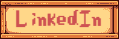

<h1 align="center">

Hey! I'm Sofia

</h1>

Cofounder | Mobile Engineer | JS Cochabamba Organizer | +7 years of coding and fighting bugs🗡

- I loooove developing for mobile (with Flutter 💙), but I also like some web dev too :)
- 🚀 I'm currently working on my startup: Docu-Menta, seeking to make science accesible in Spanish.
- 👩‍💻 I'm looking to contribute to open source, hoping to open some PRs soon! In the meantime, you can check out [epub_decoder](https://pub.dev/packages/epub_decoder) for Flutter and [find-and-lowercase](https://github.com/marketplace/actions/find-and-lowercase) action.
- I like to participate on hackathons and sometimes even win them (check out [my LinkedIn](https://www.linkedin.com/in/sofitoro/) if you feel curious ^^).
- I really enjoy to play Stardew Valley 🐤 If you can help me to achieve perfection, I will be very grateful.

- 💛 Cofounder of [JavaScript Cochabamba](https://www.instagram.com/js.cochabamba/) along with another great and nerd folks (as me).
-  Former Lead at Google Developer Student Club Univalle 2022 - 2023.
- 🎤 Speaker at local meetups and tech events like NG Bolivia, NG She Bolivia and FLISoL (Latin American Open Source Software Installation Festival).
- 📌 Organized many local meetups and some bigger tech events like International Women's Day Cochabamba and DevFest Cochabamba, impacting more +300 students in STEM!
- You can see more details [here](community/events/README.md) and [here](community/talks/README.md) if you're interested :)

If I can help you with anything, don't hesitate to reach me out on  
