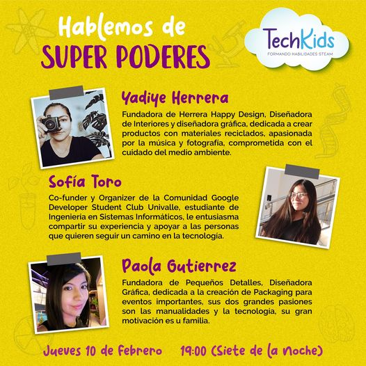
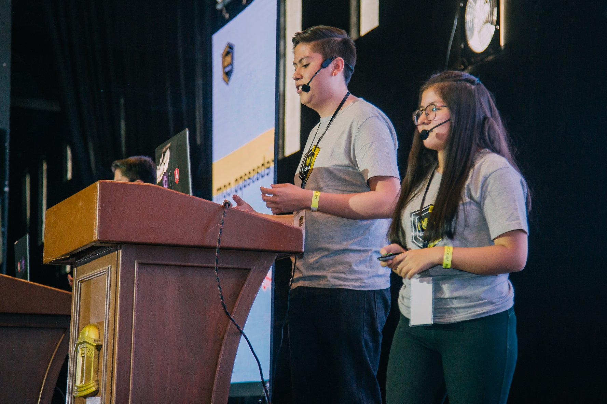
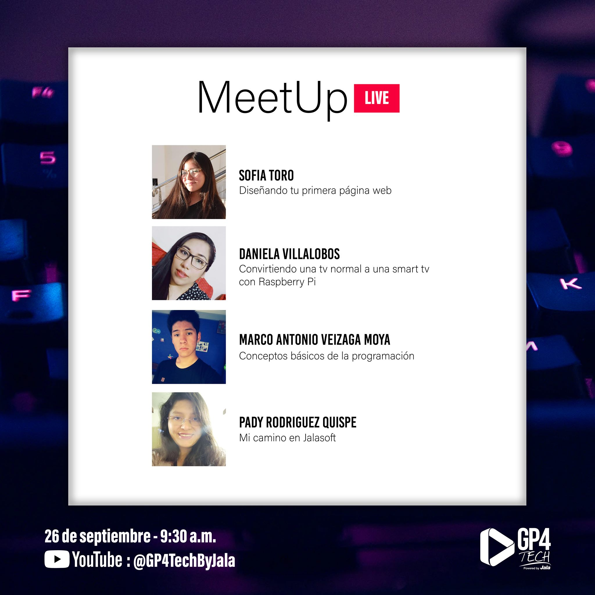
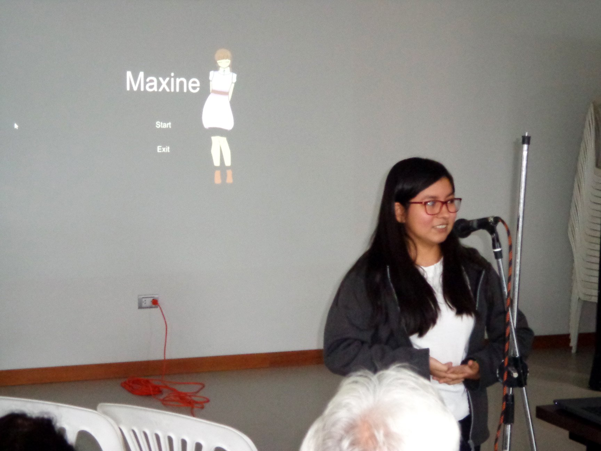
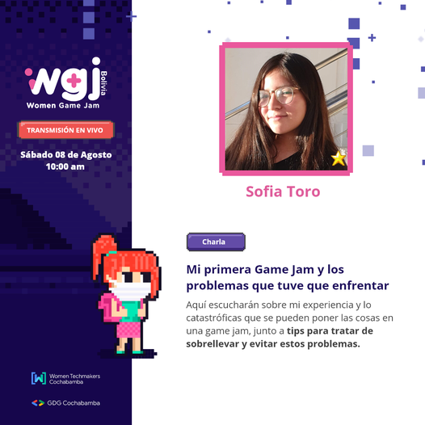
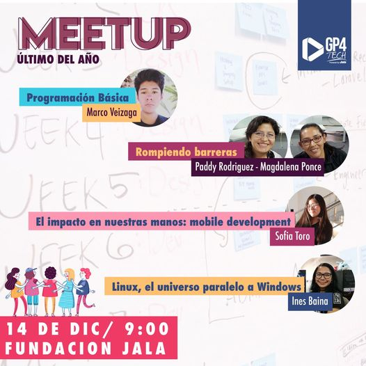
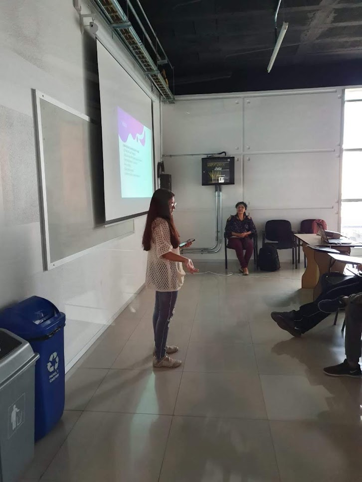

# Talks

### Table of Contents

1. [Bolivian Women's Day 2023 (as mentor)](#bolivian-womens-day-2023-as-mentor--google-developers-group-cochabamba)
2. [Program in Women's Code](#program-in-womens-code--tecba-meetup-2023)
3. [Let's talk about Super Powers](#lets-talk-about-super-powers--tech-kids-2022)
4. [NgRx from Zero to Hero](#ngrx-from-zero-to-hero--ng-bolivia-2019)
5. [CI/CD for your Flutter project with GitHub Actions](#cicd-for-your-flutter-project-with-github-actions--flisol-cochabamba-2022)
6. [Designing your first web page](#designing-your-first-web-page--gp4tech-meetup-sept-2020)
7. [What to do during a Game Jam crisis and how to avoid it](#what-to-do-during-a-game-jam-crisis-and-how-to-avoid-it--global-game-jam-bolivia-2020)
8. [My first Game Jam and the problems I had to face](#my-first-game-jam-and-the-problems-i-had-to-face--women-game-jam-bolivia-2020)
9. [The impact in our hands: Mobile Development](#the-impact-in-our-hands-mobile-development--gp4tech-meetup-dic-2019)
10. [Build your first app, like us](#build-your-first-app-like-us--flisol-cochabamba-2019)
11. [My experience in Technovation Challenge](#my-experience-in-technovation-challenge--girls-power-tech-2019)
12. [Get started in Stark Industries!](#get-started-in-stark-industries--weekend-coding-2019)

## Bolivian Women's Day 2023 (as mentor) | Google Developers Group Cochabamba

## Program in Women's Code | TECBA Meetup 2023

For Bolivian Women's Day 💖💛💚

> https://www.facebook.com/share/v/j7hLykTdEDxVyFq5/ [start from 32:00]

- https://www.facebook.com/share/p/XHagbQYWF7NabpYZ/

## Let's talk about Super Powers | Tech Kids 2022

For women and girls in science day 🔬

- https://www.facebook.com/share/p/3hDPBC1mWg6ueo2P/

## NgRx from Zero to Hero | NG Bolivia 2019

> https://youtu.be/QCde95lTMLE?si=OuswvLz3hygXMW6j

- https://www.facebook.com/share/8A4NQDVasXbqDWjM/
- https://www.facebook.com/share/LjR6RvdQobESyKFi/

## CI/CD for your Flutter project with GitHub Actions | Flisol Cochabamba 2022

> https://www.youtube.com/watch?v=lhZt-6fTCMA&t=16538s

- https://www.facebook.com/share/p/Md9orX2g6qS7DJ3P/

## Designing your first web page | GP4Tech Meetup Sept. 2020

> https://www.youtube.com/live/HqhXCTAgOvQ?si=U9a0fe4SgvY0v8dQ&t=446

- https://www.facebook.com/share/p/LfgeBP5YCvVuNKW6/

## What to do during a Game Jam crisis and how to avoid it | Global Game Jam Bolivia 2020

- https://www.facebook.com/share/vTE9L26rrKJNPumb/

## My first Game Jam and the problems I had to face | Women Game Jam Bolivia 2020

> https://www.youtube.com/live/ei9RbnuG5RM?si=pPt8iluzjtZVQNe3&t=362

- https://www.facebook.com/share/p/jYxjvJWSEWnfo1HG/

## The impact in our hands: Mobile Development | GP4Tech Meetup Dic. 2019

- https://www.facebook.com/share/p/gccQvSxya5YUcNiY/

## Build your first app, like us | Flisol Cochabamba 2019

- https://www.facebook.com/share/LBuW6TDvrcxMdPT7/

## My experience in Technovation Challenge | Girls Power Tech 2019

- https://www.facebook.com/share/jsLjdjYKjcdNaWbE/

## Get started in Stark Industries! | Weekend Coding 2019

- https://www.facebook.com/share/p/o6QLbfJtngv6zbMh/
